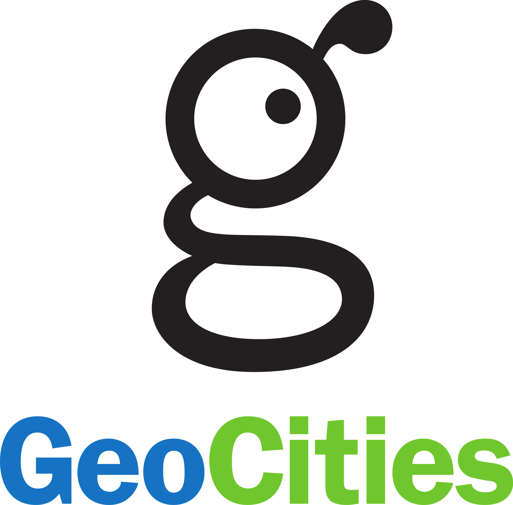

# SMX2-M8UF1A1-Geocities-ErickGutierrez
## ¿Que es?
### Es un servicio de alojamiento web que gano demasiada popularidad a finales de la década de 1990 y principios de la de 2000. 

## ¿Quien lo creo?
|Origen|Foto del creador|
|------------------------|--------------------|
|Netscape fue creado por NCC (*Netscape Communications Corporation*), una compañia fundada por Marc Andreesen y Jim Clark.   ||