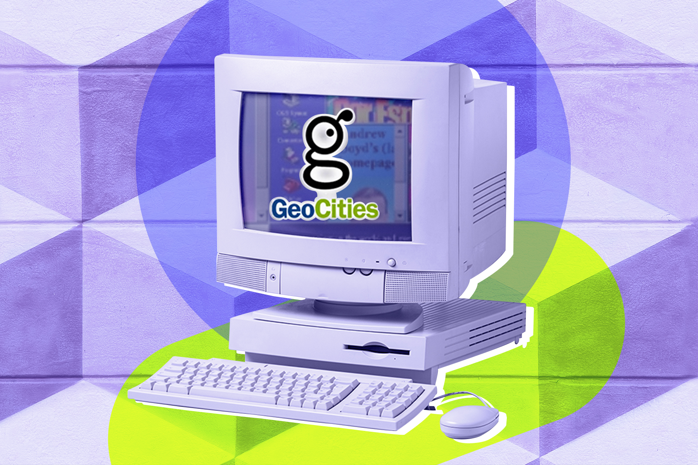

# SMX2-M8UF1A1-Geocities-ErickGutierrez
## ¿Que es?
### Es un servicio de alojamiento web que gano demasiada popularidad a finales de la década de 1990 y principios de la de 2000. 

## ¿Quien lo creo?
|Origen||
|------------------------|--------------------|
| GeoCities fue fundado por David Bohnett y John Rezner en 1994.| |

## *David Bohnett*
Es un empresario y filántropo estadounidense, conocido por ser uno de los fundadores de GeoCities. David Bohnett conocido por su contribución significativa al desarrollo temprano de la web y la creación de GeoCities, una plataforma de alojamiento web que permitió a los usuarios crear sus propias páginas web de manera sencilla.

